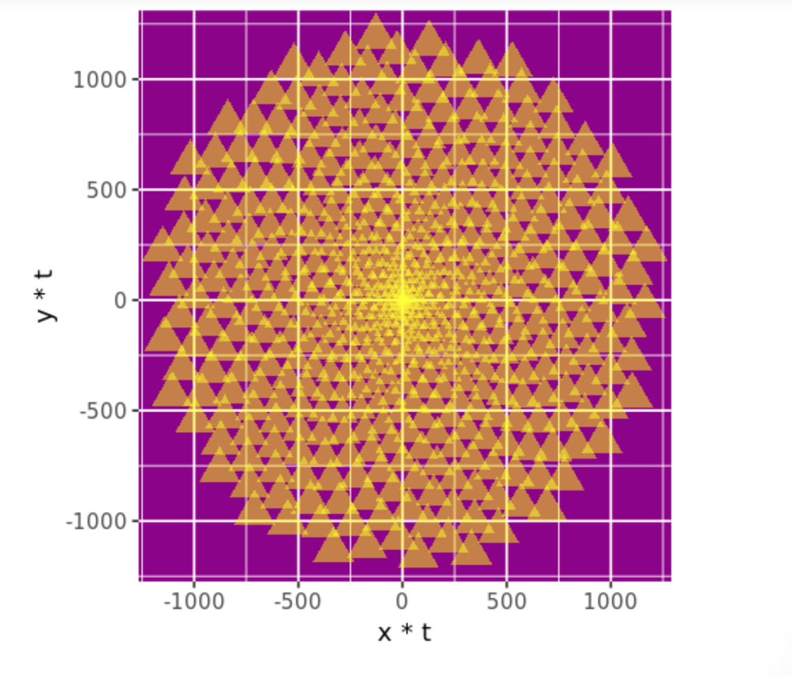
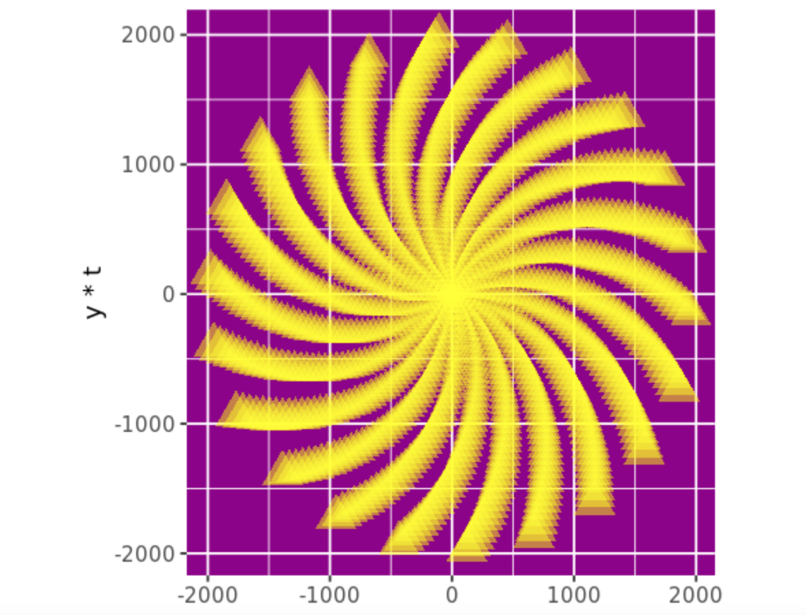
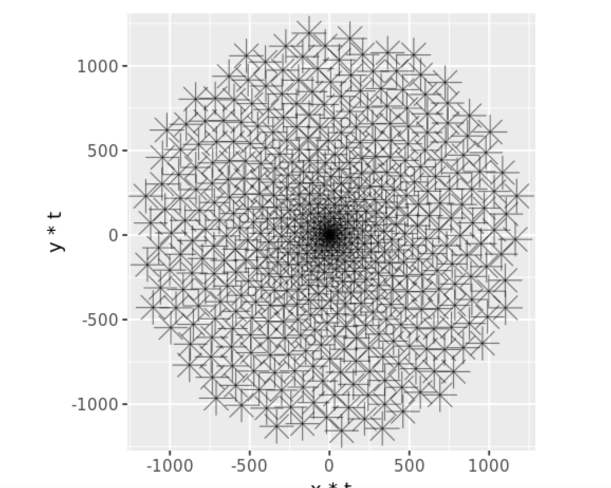

# Generative Art Using R, Inspired by Phyllotaxis 

Used the ggplot2 R package to generate artistic images inspired by the ways plants arrange their leaves.

Harmonized the “leaves” using the golden angle:

### π(3 - √5)

This equation defines the way the leaves spiral, and can also be found in pine cones, shells, hurricanes, etc.

### Sunflower

### Modified Sunflower

### Dandelion

